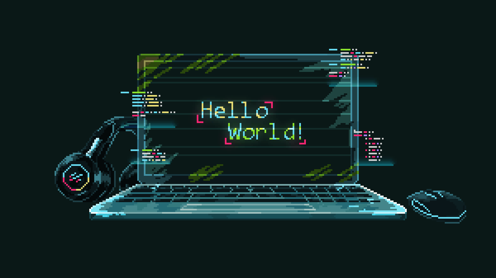

# 🚀 Jefferson Silva | Full Stack Developer

<div align="center">
  
  <p align="center">
  
</p>
  
</div>

---

## 🎯 Sobre Mim


```typescript
const jeffersonSilva = {
  name: "Jefferson Silva",
  role: "Full Stack Developer",
  location: "São Paulo, Brasil 🇧🇷",
  experience: "2+ anos",
  code: ["JavaScript", "TypeScript", "React-Native", "Flutter"],
  askMeAbout: ["web dev", "tech", "app dev", "database design", "clean code"],
  technologies: {
    frontEnd: {
      js: ["React", "Next.js"],
      css: ["Tailwind", "Styled Components", "SASS", "Bootstrap"],
      mobile: ["React Native", "Flutter"]
    },
    backEnd: {
      js: ["Node.js", "Express", "NestJS", "Fastify"],
      databases: ["MongoDB", "PostgreSQL", "MySQL", "Redis"]
    },
    devOps: ["Docker", "AWS", "Vercel", "Heroku", "Railway"],
    tools: ["Git", "Webpack", "Vite", "Jest", "Cypress", "Postman"]
  },
  currentFocus: "Construindo aplicações escaláveis e performáticas",
  funFact: "Debug é 90% café e 10% código ☕",
  workingOn: "Projetos open source e freelances"
};
```

<br clear="right"/>

---

## 📊 Estatísticas GitHub


  

<div align="center">
  
</div>

---

## 🏆 Conquistas GitHub

<div align="center">
  
</div>

---

## 💻 Stack Tecnológica

<div align="center">

### 🎨 Frontend


### ⚙️ Backend & Database


### 🗄️ Bancos de Dados


### 📱 Mobile


</div>

---

## 📌 Projetos em Destaque

<div align="center">
  
 
  <a href="https://github.com/jeffsilva03/ProjetoSemestral---LIBRALI">
    
  </a>

  <a href="https://github.com/jeffsilva03/APPSENAIindustria4.0">
    
  </a>

   <a href="https://github.com/jeffsilva03/augebitMOBILE">
    
  </a>
  
  
</div>

> 💡 **Dica:** Confira todos os meus repositórios para descobrir mais projetos interessantes!

---


## 📊 Estatísticas de Desenvolvimento

<div align="center">
  
  
  
</div>

<div align="center">
  
  
</div>

<div align="center">
  
  
</div>

---


## 💬 Citação Inspiradora

<div align="center">
  
  
  
</div>

---

## 🤝 Vamos Conectar?

<div align="center">
  
  [](mailto:jeffop801@gmail.com)
  [](https://www.linkedin.com/in/jefferson-silva-355620323/)
  []([https://jeffsilva.dev](http://www.jeffcode.rf.gd/index.php))
  
</div>

---


<div align="center">
  
  ### 💡 *"Code is poetry written in logic"*
  
  **Transformando ideias em realidade através do código! 🚀**
  
  <sub>⭐ **Se você gostou do meu trabalho, considere dar uma estrela nos repositórios!** ⭐</sub>
  
</div>

---


---

<div align="center">
  <b>Feito com ❤️ e muito ☕</b>
</div>
